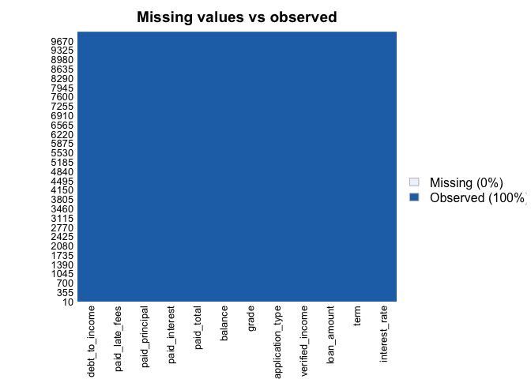
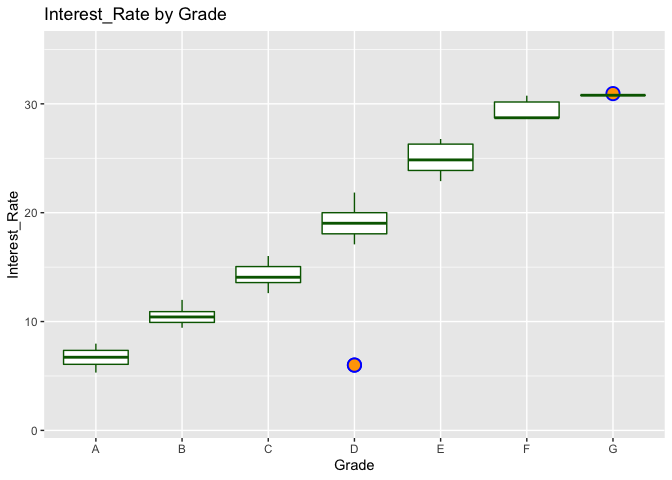
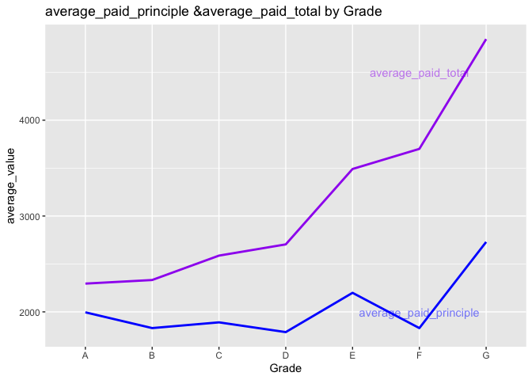
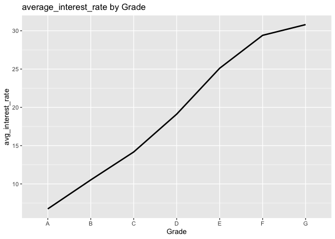
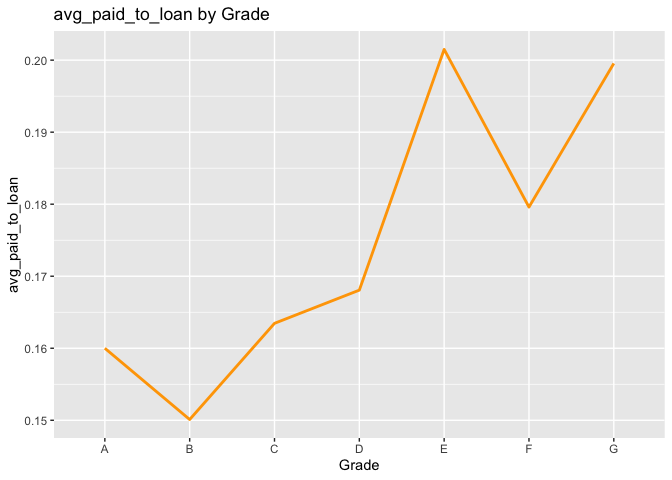
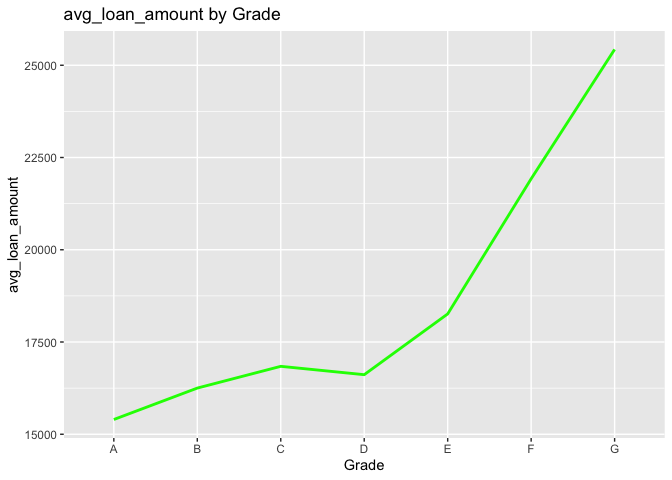
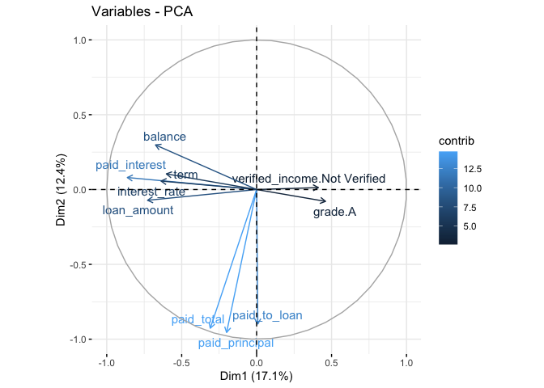

case\_study
================
Shuang Du
10/29/2021

### Data Overview

This data set represents thousands of loans made through the Lending
Club platform, which is a platform that allows individuals to lend to
other individuals. Someone who is a essentially a sure bet to pay back a
loan will have an easier time getting a loan with a low interest rate
than someone who appears to be riskier. The original dataset can be
downloaded from
<https://www.openintro.org/data/index.php?data=loans_full_schema>

The first part of this report will be a general overview of the given
data set. We will conduct necessary assumptions and data cleaning in
this part.

``` python
import pandas as pd
import numpy as np
data = pd.read_csv("loans_full_schema.csv")
#head(data)
data.info
```

As we can find from the result, the data set has 10000 observations on
55 variables. After an initial examination, we can keep only the
important variables for the next-step analysis. We should keep the
variables which are related to loan amounts (emp\_title, interest rate,
debt\_to\_income, term, loan\_amount, verified\_income, loan\_purpose,
application\_type, grade, balance, paid\_total, paid\_interest,
paid\_principal, paid\_late\_fees)

``` r
library(dplyr)
original_data <- read.csv(file = "loans_full_schema.csv", header = TRUE )
# select only the important variables and create a new table
data <- original_data %>% select(interest_rate, debt_to_income, term, loan_amount, verified_income, application_type, grade, balance,paid_total,paid_interest, paid_principal, paid_late_fees )
sum(is.na(data)) # 24
```

    ## [1] 24

``` r
# check missing values
library(Amelia)
missmap(data, main = "Missing values vs observed")
```

<!-- --> Now we want to
analyse the data distribution for each loan grade from “A” to “G”

``` r
aggregate(data$interest_rate, by=list(data$grade),mean)
```

    ##   Group.1         x
    ## 1       A  6.742631
    ## 2       B 10.524103
    ## 3       C 14.176698
    ## 4       D 19.113451
    ## 5       E 25.103403
    ## 6       F 29.401897
    ## 7       G 30.802500

``` r
library(ggplot2)

ggplot(data, aes(grade, interest_rate)) + 
    geom_boxplot(fill = "white", color = "darkgreen", 
                 outlier.shape=21, outlier.size=4, outlier.stroke = 1,
                 outlier.color = "blue", outlier.fill = "orange")+ labs(x = "Grade", y = "Interest_Rate", title = "Interest_Rate by Grade") +scale_y_continuous(limits=c(1,35))
```

<!-- --> Then we want
to investigate the differnce of interest rate, paid total, paid
principle between different loan grades.

``` r
#summarize the data after group by grade
data <- mutate(data, paid_to_loan = paid_total/loan_amount)
data1 <- data %>%
  group_by(grade)%>%
  summarize(count = n(),
            avg_paid_principal=mean(paid_principal,na.rm=T),
            avg_paid_total = mean(paid_total,na.rm=T),
            avg_paid_to_loan = mean(paid_to_loan,na.rm=T),
            avg_loan_amount = mean(loan_amount,na.rm=T),
            avg_r=mean(interest_rate,na.rm=T))
```

``` r
ggplot(data1) + geom_line(aes(x=grade,y=avg_paid_principal,group =1),color = "blue",size=1)+
  geom_line(aes(x=grade,y=avg_paid_total,group =1),color = "purple",size = 1) +
  labs(x = "Grade", y = "average_value", title = "average_paid_principle &average_paid_total by Grade") + annotate("text", x="F", y=4500, label="average_paid_total", alpha=0.5,color ="purple") +
  annotate("text", x="F", y=2000, label="average_paid_principle",alpha=0.5, color="blue")
```

<!-- -->

``` r
ggplot(data1) + geom_line(aes(x=grade,y=avg_r,group =1),color = "black",size =1)+
   labs(x = "Grade", y = "avg_interest_rate", title = "average_interest_rate by Grade")
```

<!-- -->

``` r
ggplot(data1) + geom_line(aes(x=grade,y=avg_paid_to_loan,group =1),color = "orange",size =1)+
   labs(x = "Grade", y = "avg_paid_to_loan", title = "avg_paid_to_loan by Grade")
```

<!-- -->

``` r
ggplot(data1) + geom_line(aes(x=grade,y=avg_loan_amount,group =1),color = "green",size =1)+
   labs(x = "Grade", y = "avg_loan_amount", title = "avg_loan_amount by Grade")
```

<!-- -->

Loan grading is a classification system that involves assigning a
quality score to a loan based on a borrower’s credit history, quality of
the collateral, and the likelihood of repayment of the principal and
interest. We can conclude from the above figures that the average
interest\_rate arises when the loan grade becomes lower. For loan grade
from A to G, the average paid total, average paid principle and average
paid total to loan percentage increases. To explore the reason of this
trend, we also plot the average loan amount by loan grade. From the
result we can conclude that the loans which have lower grades usually
have larger average loan amounts so that drive up the average paid total
amount for the low-grade loans.

### Further analysis

Next, we want to find out which factors have contribute to the value of
interest rate.

``` r
#create dummy variables
library(dummies) 
data <- na.omit(data)
data_dummy <- dummy.data.frame(data, names = c("verified_income","application_type","grade"),sep=".")
my_data <- scale(data_dummy, center = T, scale =T)
mydata.pca <- prcomp(my_data, center = F,scale. = F)
summary(mydata.pca)
```

    ## Importance of components:
    ##                           PC1    PC2     PC3     PC4     PC5     PC6     PC7
    ## Standard deviation     1.9378 1.6545 1.44383 1.40726 1.27371 1.18229 1.13659
    ## Proportion of Variance 0.1707 0.1244 0.09476 0.09002 0.07374 0.06354 0.05872
    ## Cumulative Proportion  0.1707 0.2951 0.38986 0.47988 0.55362 0.61716 0.67588
    ##                            PC8     PC9    PC10    PC11    PC12    PC13    PC14
    ## Standard deviation     1.09764 1.03755 1.00431 1.00080 0.99654 0.89274 0.78946
    ## Proportion of Variance 0.05476 0.04893 0.04585 0.04553 0.04514 0.03623 0.02833
    ## Cumulative Proportion  0.73064 0.77957 0.82542 0.87095 0.91609 0.95231 0.98064
    ##                           PC15    PC16   PC17    PC18      PC19      PC20
    ## Standard deviation     0.48107 0.40909 0.1627 0.02442 1.071e-07 4.871e-15
    ## Proportion of Variance 0.01052 0.00761 0.0012 0.00003 0.000e+00 0.000e+00
    ## Cumulative Proportion  0.99116 0.99877 1.0000 1.00000 1.000e+00 1.000e+00
    ##                             PC21      PC22
    ## Standard deviation     2.143e-15 1.947e-15
    ## Proportion of Variance 0.000e+00 0.000e+00
    ## Cumulative Proportion  1.000e+00 1.000e+00

``` r
library(factoextra)
 fviz_pca_var(mydata.pca, select.var= list(cos2 = 10), repel=T, col.var = "contrib")
```

<!-- --> From the
above PCA analysis, we can choose the ones that have higher contribution
to the model. conduct linear regression analysis for interest rate

``` r
#Splitting the data using a function from dplyr package
library(caret)
#We will be predicting interest rate using the loan records
index <- createDataPartition(data$interest_rate, p = .70, list = FALSE)
train <- data[index,]
test <- data[-index,]
```

``` r
lm1 <- lm(interest_rate ~ grade+debt_to_income+loan_amount+verified_income+application_type+
            term + balance+paid_total+paid_principal, data = data)
summary(lm1)
```

    ## 
    ## Call:
    ## lm(formula = interest_rate ~ grade + debt_to_income + loan_amount + 
    ##     verified_income + application_type + term + balance + paid_total + 
    ##     paid_principal, data = data)
    ## 
    ## Residuals:
    ##      Min       1Q   Median       3Q      Max 
    ## -12.8932  -0.7540  -0.1065   0.8033   3.6773 
    ## 
    ## Coefficients:
    ##                                  Estimate Std. Error t value Pr(>|t|)    
    ## (Intercept)                     6.664e+00  4.997e-02 133.362  < 2e-16 ***
    ## gradeB                          3.591e+00  3.085e-02 116.430  < 2e-16 ***
    ## gradeC                          7.065e+00  3.486e-02 202.682  < 2e-16 ***
    ## gradeD                          1.178e+01  4.476e-02 263.256  < 2e-16 ***
    ## gradeE                          1.747e+01  7.510e-02 232.600  < 2e-16 ***
    ## gradeF                          2.139e+01  1.566e-01 136.591  < 2e-16 ***
    ## gradeG                          2.271e+01  3.193e-01  71.114  < 2e-16 ***
    ## debt_to_income                  3.747e-03  7.741e-04   4.840 1.32e-06 ***
    ## loan_amount                    -1.933e-05  3.038e-05  -0.636   0.5246    
    ## verified_incomeSource Verified  1.481e-01  2.537e-02   5.837 5.48e-09 ***
    ## verified_incomeVerified         2.335e-01  3.066e-02   7.614 2.89e-14 ***
    ## application_typejoint          -6.407e-02  3.259e-02  -1.966   0.0493 *  
    ## term                            5.293e-03  1.154e-03   4.586 4.56e-06 ***
    ## balance                        -1.586e-05  3.036e-05  -0.523   0.6013    
    ## paid_total                      8.245e-04  4.179e-05  19.731  < 2e-16 ***
    ## paid_principal                 -8.229e-04  5.187e-05 -15.864  < 2e-16 ***
    ## ---
    ## Signif. codes:  0 '***' 0.001 '**' 0.01 '*' 0.05 '.' 0.1 ' ' 1
    ## 
    ## Residual standard error: 1.081 on 9960 degrees of freedom
    ## Multiple R-squared:  0.9533, Adjusted R-squared:  0.9532 
    ## F-statistic: 1.355e+04 on 15 and 9960 DF,  p-value: < 2.2e-16

the loan\_amount and balance are not significant remove we get the new
model:

``` r
lm2 <- lm(interest_rate ~ grade+debt_to_income+verified_income+application_type+
            term +paid_total+paid_principal, data = data)
summary(lm2)
```

    ## 
    ## Call:
    ## lm(formula = interest_rate ~ grade + debt_to_income + verified_income + 
    ##     application_type + term + paid_total + paid_principal, data = data)
    ## 
    ## Residuals:
    ##      Min       1Q   Median       3Q      Max 
    ## -13.0926  -0.7543  -0.0743   0.7952   3.0507 
    ## 
    ## Coefficients:
    ##                                  Estimate Std. Error t value Pr(>|t|)    
    ## (Intercept)                     6.499e+00  4.997e-02 130.055  < 2e-16 ***
    ## gradeB                          3.704e+00  3.073e-02 120.515  < 2e-16 ***
    ## gradeC                          7.289e+00  3.318e-02 219.661  < 2e-16 ***
    ## gradeD                          1.216e+01  4.051e-02 300.082  < 2e-16 ***
    ## gradeE                          1.804e+01  6.951e-02 259.541  < 2e-16 ***
    ## gradeF                          2.220e+01  1.529e-01 145.193  < 2e-16 ***
    ## gradeG                          2.354e+01  3.214e-01  73.243  < 2e-16 ***
    ## debt_to_income                  3.983e-03  7.869e-04   5.062 4.23e-07 ***
    ## verified_incomeSource Verified  1.019e-01  2.566e-02   3.970 7.23e-05 ***
    ## verified_incomeVerified         1.521e-01  3.084e-02   4.931 8.31e-07 ***
    ## application_typejoint          -9.788e-02  3.308e-02  -2.959  0.00309 ** 
    ## term                            1.720e-03  1.156e-03   1.488  0.13690    
    ## paid_total                      2.328e-04  2.703e-05   8.610  < 2e-16 ***
    ## paid_principal                 -2.340e-04  2.741e-05  -8.537  < 2e-16 ***
    ## ---
    ## Signif. codes:  0 '***' 0.001 '**' 0.01 '*' 0.05 '.' 0.1 ' ' 1
    ## 
    ## Residual standard error: 1.099 on 9962 degrees of freedom
    ## Multiple R-squared:  0.9517, Adjusted R-squared:  0.9516 
    ## F-statistic: 1.51e+04 on 13 and 9962 DF,  p-value: < 2.2e-16

the result show that the term is not statistically significant, remove
term we get the new model:

``` r
lm3 <- lm(interest_rate ~ grade+debt_to_income+verified_income+application_type+
            paid_total+paid_principal, data = data)
summary(lm3)
```

    ## 
    ## Call:
    ## lm(formula = interest_rate ~ grade + debt_to_income + verified_income + 
    ##     application_type + paid_total + paid_principal, data = data)
    ## 
    ## Residuals:
    ##      Min       1Q   Median       3Q      Max 
    ## -13.1186  -0.7519  -0.0725   0.8040   3.0827 
    ## 
    ## Coefficients:
    ##                                  Estimate Std. Error t value Pr(>|t|)    
    ## (Intercept)                     6.5591611  0.0289435 226.619  < 2e-16 ***
    ## gradeB                          3.7107160  0.0304010 122.059  < 2e-16 ***
    ## gradeC                          7.2980506  0.0326438 223.566  < 2e-16 ***
    ## gradeD                         12.1659751  0.0400945 303.432  < 2e-16 ***
    ## gradeE                         18.0513490  0.0690537 261.410  < 2e-16 ***
    ## gradeF                         22.2135031  0.1525901 145.576  < 2e-16 ***
    ## gradeG                         23.5491898  0.3213272  73.287  < 2e-16 ***
    ## debt_to_income                  0.0039274  0.0007860   4.997 5.94e-07 ***
    ## verified_incomeSource Verified  0.1016924  0.0256640   3.962 7.47e-05 ***
    ## verified_incomeVerified         0.1516350  0.0308422   4.916 8.95e-07 ***
    ## application_typejoint          -0.0944466  0.0329979  -2.862  0.00422 ** 
    ## paid_total                      0.0002469  0.0000253   9.759  < 2e-16 ***
    ## paid_principal                 -0.0002482  0.0000257  -9.658  < 2e-16 ***
    ## ---
    ## Signif. codes:  0 '***' 0.001 '**' 0.01 '*' 0.05 '.' 0.1 ' ' 1
    ## 
    ## Residual standard error: 1.099 on 9963 degrees of freedom
    ## Multiple R-squared:  0.9517, Adjusted R-squared:  0.9516 
    ## F-statistic: 1.635e+04 on 12 and 9963 DF,  p-value: < 2.2e-16

### Predicting & Validating the model

To validate the model, we will be looking at the accuracy of the model.
This accuracy can be calculated from the classification table.

``` r
train$predicted <- predict(lm3, newdata = train, interval="prediction")
test$predicted <- predict(lm3, newdata = test, interval="prediction")
RMSE1 = sqrt(mean((train$interest_rate - train$predicted)^2))
print(RMSE1)
```

    ## [1] 2.075969

``` r
RMSE2 =sqrt(mean((test$interest_rate - test$predicted)^2))
print(RMSE2)
```

    ## [1] 2.072868

An RMSE of around 2 doesn’t seem to be bad giving the , especially for a
general linear regression model using that only uses ridge regression to
account for potential multicollineararity between features. Also, this
linear model is pretty fast in computation time and seemingly
straightforward in deploying and maintaing within production. However,
without having RMSE’s of other models to compare it to, it is difficult
to understand the true value of or whether or not this model is “good”
or even “fair”. So we will try another machine learning technique to
compare the models RMSE scores.
