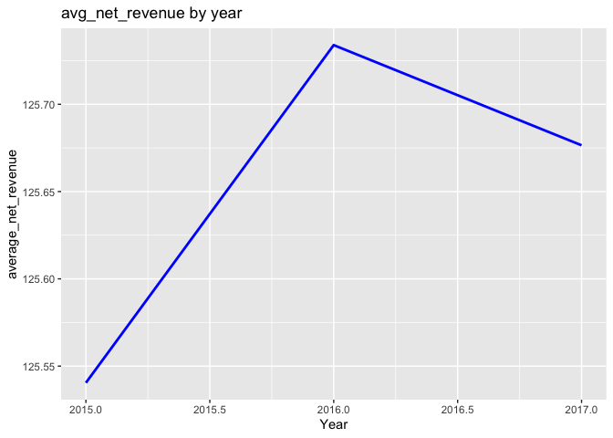
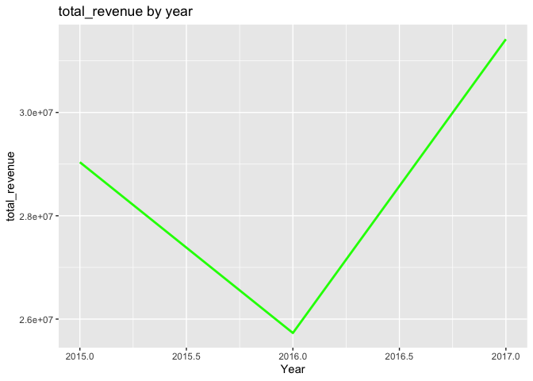
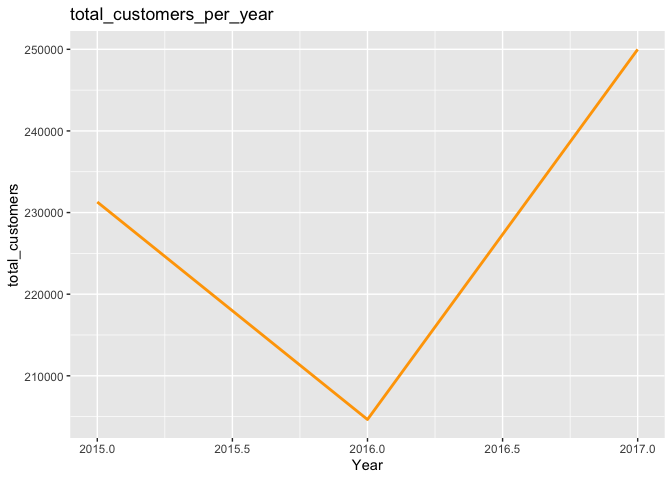
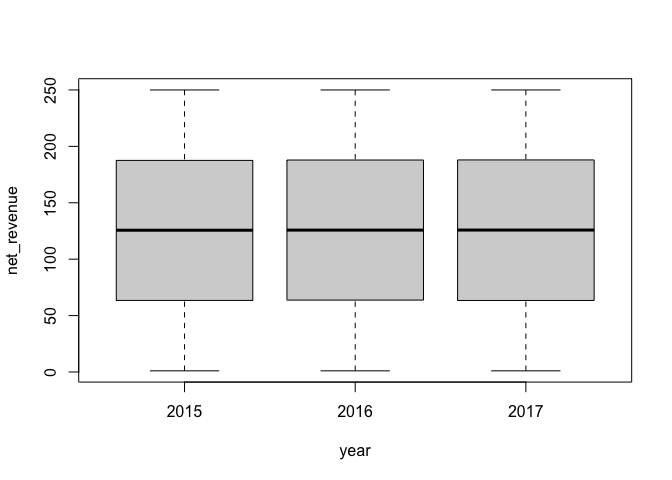

casestudy2
================
Shuang Du
10/31/2021

## casestudy2

``` r
#import data
d <- read.csv(file = "casestudy.csv", header = TRUE )
#check missing values
sum(is.na(d))
```

    ## [1] 0

From the above results, we can conclude there is no missing data within
the dataset. Next, we can conduct required calculations in R. To
facilitate the calculation process and make the process more clear, I
chose sqldf package which can allow us write sql queries in R.

### Total revenue for the current year

``` r
library(sqldf)
net_revenue_by_year = sqldf("select year, sum(net_revenue)  as net_revenue_by_year 
                             from d group by year ")

net_revenue_by_year
```

    ##   year net_revenue_by_year
    ## 1 2015            29036749
    ## 2 2016            25730944
    ## 3 2017            31417495

### New Customer Revenue e.g., new customers not present in previous year only

``` r
#for year 2016
new_customers_2016 = sqldf("select * from d where d.customer_email 
not in(select distinct customer_email from d where year = '2015') and d.year ='2016'")

#for year 2016
new_customers_2017 = sqldf("select * from d where d.customer_email 
not in(select distinct customer_email from d where year = '2016') and d.year ='2017'")
```

``` r
#The above tables have include all information fro new customers
new_customer_revenue_2016 = sqldf("select sum(net_revenue) as new_customer_revenue_2016 from new_customers_2016")
new_customer_revenue_2016
```

    ##   new_customer_revenue_2016
    ## 1                  18245491

``` r
new_customer_revenue_2017 = sqldf("select sum(net_revenue) as new_customer_revenue_2017 from new_customers_2017")
new_customer_revenue_2017
```

    ##   new_customer_revenue_2017
    ## 1                  28776235

### Revenue lost from attrition

``` r
#for year2015, we do not have the previous year data(year2014), so we can not conduct relevant analysis
#for year 2016
Revenue_lost_2016 = sqldf("select sum(net_revenue) from d where d.customer_email 
not in(select distinct customer_email from d where year = '2016') and d.year ='2015'")
Revenue_lost_2016
```

    ##   sum(net_revenue)
    ## 1         21571632

``` r
#for year 2017
Revenue_lost_2017 = sqldf("select sum(net_revenue)  from d where d.customer_email 
not in(select distinct customer_email from d where year = '2017') and d.year ='2016'")
Revenue_lost_2017
```

    ##   sum(net_revenue)
    ## 1         23110295

### Existing Customer Growth. To calculate this, use the Revenue of existing customers for current year –(minus) Revenue of existing customers from the previous year

``` r
#for year2015, we do not have the previous year data(year2014), so we can not conduct relevant analysis
#for year 2016
Existing_Customer_Growth_2016 = sqldf("select sum(net_revenue) from d where d.year ='2016'") - sqldf("select sum(net_revenue) from d where d.year ='2015'")
Existing_Customer_Growth_2016
```

    ##   sum(net_revenue)
    ## 1         -3305806

``` r
#for year 2017
Existing_Customer_Growth_2017 = sqldf("select sum(net_revenue) from d where d.year ='2017'") - sqldf("select sum(net_revenue) from d where d.year ='2016'")
Existing_Customer_Growth_2017
```

    ##   sum(net_revenue)
    ## 1          5686551

### Existing Customer Revenue Current Year & Existing Customer Revenue Prior Year

we need to clarify the definition of existing customers, here we assume
existing customers are the group of customers who continuously used
product both for current year and the previous year

``` r
# for year 2016
existing_customer_revenue_2016 = sqldf("select sum(net_revenue)  as existing_customer_revenue_2016
                             from d where d.customer_email 
in(select distinct customer_email from d where year = '2015'and '2016')")
existing_customer_revenue_2016
```

    ##   existing_customer_revenue_2016
    ## 1                       37386217

``` r
# for year 2017
existing_customer_revenue_2017 = sqldf("select sum(net_revenue)  as existing_customer_revenue_2017
                             from d where d.customer_email 
in(select distinct customer_email from d where year = '2016' and '2017')")
existing_customer_revenue_2017
```

    ##   existing_customer_revenue_2017
    ## 1                       35837321

### Total Customers Current Year & Total Customers Previous Year

``` r
total_customers = sqldf("select year, count(distinct customer_email)  as total_customers_per_year
                             from d group by year ")
total_customers
```

    ##   year total_customers_per_year
    ## 1 2015                   231294
    ## 2 2016                   204646
    ## 3 2017                   249987

### New Customers

``` r
#for year2015, we do not have the previous year data(year2014), so we can not conduct relevant analysis
#for year 2016
new_customers_2016 = sqldf("select customer_email from d where d.customer_email 
not in(select distinct customer_email from d where year = '2015') and d.year ='2016'")
head(new_customers_2016)
```

    ##          customer_email
    ## 1  mwrossuukz@gmail.com
    ## 2  gkwsoupawk@gmail.com
    ## 3  vlyigtgfzs@gmail.com
    ## 4  yfirychuhk@gmail.com
    ## 5  trnzgqinuu@gmail.com
    ## 6  hhxxpwlakg@gmail.com

``` r
#number of new customers_in_2016
length(new_customers_2017$customer_email)
```

    ## [1] 229028

``` r
#for year 2017
new_customers_2017 = sqldf("select customer_email from d where d.customer_email 
not in(select distinct customer_email from d where year = '2016') and d.year ='2017'")
head(new_customers_2017)
```

    ##          customer_email
    ## 1  mwrossuukz@gmail.com
    ## 2 qvjfterwnk@gmail.com 
    ## 3  vlyigtgfzs@gmail.com
    ## 4  yfirychuhk@gmail.com
    ## 5  fdkiioqtli@gmail.com
    ## 6  vpsfdhgrfo@gmail.com

``` r
#number of new customers_in_2017
length(new_customers_2017$customer_email)
```

    ## [1] 229028

### Lost Customers

``` r
#for year2015, we do not have the previous year data(year2014), so we can not conduct relevant analysis
#for year 2016
lost_customers_2016 = sqldf("select customer_email from d where d.customer_email 
not in(select distinct customer_email from d where year = '2016') and d.year ='2015'")
head(lost_customers_2016)
```

    ##          customer_email
    ## 1  nhknapwsbx@gmail.com
    ## 2  joiuzbvcpn@gmail.com
    ## 3  ukkjctepxt@gmail.com
    ## 4  gykatilzrt@gmail.com
    ## 5  mmsgsrtxah@gmail.com
    ## 6  mobvusnzfr@gmail.com

``` r
#number of lost customers in 2016
length(lost_customers_2016$customer_email)
```

    ## [1] 171710

``` r
#for year 2017
lost_customers_2017 = sqldf("select customer_email from d where d.customer_email 
not in(select distinct customer_email from d where year = '2017') and d.year ='2016'")
head(lost_customers_2017)
```

    ##          customer_email
    ## 1  mwrossuukz@gmail.com
    ## 2  gkwsoupawk@gmail.com
    ## 3  vlyigtgfzs@gmail.com
    ## 4  yfirychuhk@gmail.com
    ## 5  trnzgqinuu@gmail.com
    ## 6  hhxxpwlakg@gmail.com

``` r
#number of lost customers in 2017
length(lost_customers_2017$customer_email)
```

    ## [1] 183687

Then we can draw some figures to reveal the changes of net\_revenue by
year

``` r
#summarize the data after group by grade
library(dplyr)
d1 <- d %>%
  group_by(year)%>%
  summarize(count = n(),
            avg_net_revenue=mean(net_revenue,na.rm=T),
            total_revenue = sum(net_revenue,na.rm=T),
            median_net_revenue = median(net_revenue,na.rm=T))
```

``` r
library(ggplot2)

ggplot(d1) + geom_line(aes(x=year,y=avg_net_revenue, group=1),color = "blue",size=1)+
  labs(x = "Year", y = "average_net_revenue", title = "avg_net_revenue by year")
```

<!-- -->

``` r
ggplot(d1) + geom_line(aes(x=year,y=total_revenue, group=1),color = "green",size=1)+
  labs(x = "Year", y = "total_revenue", title = "total_revenue by year")
```

<!-- --> The year 2016
has the highest average net revenue but also has the lowest total
revenue. The reason could be we have less customers in 2016 so that it
drives down the total revenue in 2016. To prove our assumption is
correct, we can draw the plot of customers per year.

``` r
ggplot(total_customers) + geom_line(aes(x=year,y=total_customers_per_year, group=1),color = "orange",size=1)+
  labs(x = "Year", y = "total_customers", title = "total_customers_per_year")
```

<!-- --> From the
above figure, we can conclude that the difference between the trend of
average revenue and the trend of total revenue is because of the shape
decrease in customer numbers in 2016.

Revenue analysis

``` r
aggregate(d$net_revenue, by=list(d$year),mean)
```

    ##   Group.1        x
    ## 1    2015 125.5404
    ## 2    2016 125.7339
    ## 3    2017 125.6765

``` r
boxplot(net_revenue~year, data = d)
```

<!-- --> From the
above boxplot figure, we can conclude that the average net\_revenue
median net\_revenue, and the quantile net\_revenue value are nearly the
same from 2015 to 2017.
